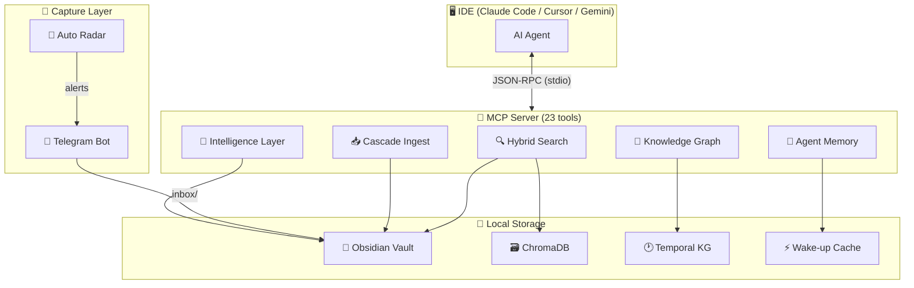

# 🧠 Obsidian Second Mind

> Transform your Obsidian vault into a **living, self-maintaining Second Brain** for AI coding agents.

[](https://python.org)
[](LICENSE)
[](https://modelcontextprotocol.io)
[](CHANGELOG.md)
[](https://github.com/nzt108-dev/obsidian-second-mind)

📐 **[Architecture Map →](docs/architecture.md)** · 📋 **[Changelog →](CHANGELOG.md)** · 📦 **[Roadmap](#%EF%B8%8F-roadmap)**

---

## 😤 The Problem

Every coding session you waste time re-explaining your project to the AI:

```
You: "We use Clerk for auth, Neon for DB, deploy to Vercel..."
AI:  "Got it! Now what were those API conventions again?"
You: [explains again. and again. and again.]
```

Your AI assistant has **no memory**. Every session starts from zero.

---

## ✅ The Solution

**Obsidian Second Mind** is an MCP server that gives AI assistants **persistent, structured memory** by connecting directly to your Obsidian vault.

```
Session 1:  You explain the architecture once  →  saved to vault
Session 2:  AI loads context in 0.1s           →  starts coding immediately
Session N:  AI remembers every decision ever made
```

One command at session start:
```
get_project_context("my-app")  →  PRD + Architecture + Guidelines + Last session
```

---

## ✨ Features

| Feature | Description |
|---------|-------------|
| 🔍 **Hybrid Search** | Semantic (ChromaDB) + BM25 keyword with RRF fusion |
| 🧬 **Temporal Knowledge Graph** | Track how your tech stack evolves over time |
| 📱 **Telegram Capture Bot** | Throw ideas from your phone → vault instantly |
| 🔄 **Cascade Ingest** | One source automatically updates N related wiki pages |
| 🧠 **Agent Memory** | Session save/load — AI never loses context between sessions |
| 🗺️ **Architecture Scanner** | Auto-generate Mermaid dependency maps from source code |
| 📡 **Tech Radar** | Scan GitHub trending → save relevant tools to vault |
| ⚡ **100% Local** | No cloud, no API keys, everything on your machine |
| 🆓 **Zero Cost** | Free forever — no subscriptions, no tokens |

---

## 🏗️ Architecture



---

## 🚀 Quick Start

### 1. Install

```bash
git clone https://github.com/nzt108-dev/obsidian-second-mind.git
cd obsidian-second-mind

python -m venv .venv
source .venv/bin/activate   # Windows: .venv\Scripts\activate
pip install -e ".[dev]"
```

### 2. Configure

```bash
cp .env.example .env
# Edit .env — set OBSIDIAN_BRIDGE_VAULT_PATH to your vault
```

### 3. Build the Index

```bash
obsidian-bridge index
```

### 4. Connect to Your IDE

**Claude Code** — add to `~/.claude.json`:
```json
{
  "mcpServers": {
    "obsidian-second-mind": {
      "command": "/path/to/.venv/bin/obsidian-bridge",
      "args": ["serve"]
    }
  }
}
```

**Cursor** — add to `.cursor/mcp.json`:
```json
{
  "mcpServers": {
    "obsidian-second-mind": {
      "command": "/path/to/.venv/bin/obsidian-bridge",
      "args": ["serve"]
    }
  }
}
```

**Gemini / Antigravity** — add to MCP settings with the same format.

### 5. (Optional) Telegram Capture Bot

```bash
# 1. Create a bot via @BotFather in Telegram
# 2. Set token in .env:
#    OBSIDIAN_BRIDGE_TELEGRAM_BOT_TOKEN=your-token
#    OBSIDIAN_BRIDGE_TELEGRAM_ALLOWED_USERS=your-telegram-id

obsidian-bridge bot
```

Now send any message to your bot → it lands in `vault/inbox/` and gets indexed.

---

## 🛠️ MCP Tools Reference (23 tools)

### 🔍 Core (7 tools)

| Tool | Description |
|------|-------------|
| `search_vault(query)` | Hybrid semantic + BM25 search across the vault |
| `get_project_context(project)` | Full project context: PRD + Architecture + Rules |
| `get_global_rules()` | Global coding standards and design principles |
| `list_projects()` | List all projects with note counts |
| `get_note(path)` | Read a specific note by path |
| `create_note(project, title, type, content)` | Create notes (10 types) |
| `update_note(path, content)` | Append or replace content in existing notes |

### 📚 Wiki & Knowledge (5 tools)

| Tool | Description |
|------|-------------|
| `lint_vault()` | Health-check: orphans, stale notes, broken links, TODOs |
| `rebuild_index()` | Rebuild vector index + regenerate index.md |
| `query_graph(type, node)` | WikiLink graph: neighbors, paths, hubs, clusters |
| `extract_patterns()` | Analyze decisions for success/failure patterns |
| `save_insight(project, title, content)` | Save synthesis back to wiki |

### 🤖 Intelligence (3 tools)

| Tool | Description |
|------|-------------|
| `analyze_sessions(project?)` | Find repeating problems across session logs |
| `scout_tools(category)` | Scan internet for new relevant tools & MCP servers |
| `check_dependencies(project)` | Check npm/pip/flutter deps for updates & security |

### 📥 Capture (3 tools)

| Tool | Description |
|------|-------------|
| `get_wakeup_context()` | Compact ~200 token context for session start |
| `ingest_source(content, project)` | Cascade ingest: 1 source → N wiki updates |
| `auto_radar_scan(category)` | Tech radar scan with diff tracking + Telegram alerts |

### 🕐 Temporal Brain (4 tools)

| Tool | Description |
|------|-------------|
| `kg_add_fact(subject, predicate, object)` | Add temporal fact with validity window |
| `kg_invalidate(subject, predicate, object)` | Mark a fact as no longer valid |
| `kg_timeline(entity)` | Chronological history of all facts about an entity |
| `kg_check_contradictions()` | Detect conflicting facts in the knowledge graph |

### 💾 Agent Memory (3 tools)

| Tool | Description |
|------|-------------|
| `save_session(project, summary, next_steps)` | Save session context to vault |
| `load_session(project)` | Load last session snapshot for instant recall |
| `get_enhanced_wakeup(project)` | Full memory: context + last session + KG facts |

---

## 📁 Vault Structure

```
~/YourVault/
├── _global/                 # Rules for ALL projects
│   ├── coding-standards.md
│   ├── tech-stack.md
│   └── design-principles.md
├── _memory/                 # Agent Memory (auto-managed)
│   ├── wakeup-cache.json
│   └── {project}-latest.json
├── _templates/              # Note templates
├── inbox/                   # Quick captures from Telegram
├── my-project/              # Per-project knowledge
│   ├── prd.md
│   ├── architecture.md
│   ├── api-rules.md
│   ├── ui-guidelines.md
│   ├── architecture-map.md  # Auto-generated dependency map
│   └── decisions/
│       └── 001-chose-postgresql.md
├── index.md                 # Auto-generated vault catalog
├── log.md                   # Chronological operation log
└── knowledge-graph.json     # Temporal KG storage
```

### Note Frontmatter

```yaml
---
project: my-project
type: architecture    # prd | architecture | guidelines | api | decision
                      # note | concept | comparison | synthesis | research
tags:
  - auth
  - postgresql
priority: high        # high | medium | low
created: 2026-04-01
updated: 2026-04-15
---
```

---

## ⚙️ CLI Reference

```bash
# Core
obsidian-bridge serve              # Start MCP server (stdio mode)
obsidian-bridge index              # Build/rebuild search index
obsidian-bridge search "auth flow" # Search from terminal
obsidian-bridge watch              # Auto-index on file changes
obsidian-bridge status             # Vault & index stats

# Projects
obsidian-bridge list-projects      # Show all projects
obsidian-bridge add-project slug   # Create project folder structure

# Capture
obsidian-bridge bot                # Start Telegram capture bot
obsidian-bridge ingest "text" -p project  # Cascade ingest from CLI
obsidian-bridge radar              # Run tech radar scan

# Agent Memory
obsidian-bridge save project       # Save session context
obsidian-bridge emergency-save project  # Fast save before context loss

# Dashboard
obsidian-bridge dashboard          # Launch web dashboard (localhost:8765)
```

---

## 🔧 How It Works

### Search Pipeline
1. **Parser** reads `.md` files, extracts YAML frontmatter, resolves `[[WikiLinks]]`
2. **Indexer** splits notes into chunks, creates embeddings via `sentence-transformers` (local)
3. **Hybrid Search** combines ChromaDB (semantic) + BM25 (keyword) with Reciprocal Rank Fusion
4. **Decay Scoring** boosts recent, high-priority notes in results

### Temporal Knowledge Graph
1. `kg_add_fact("brieftube", "uses_auth", "clerk")` — adds fact with `valid_from` date
2. When stack changes: `kg_invalidate(...)` marks old fact as expired, new fact added
3. **Contradiction Detector** flags when two active facts conflict
4. `kg_timeline("brieftube")` shows complete history: what tech was used when

### Agent Memory
1. **`save_session`** captures git state, uncommitted files, decisions made, next steps → JSON snapshot + vault note
2. **`load_session`** restores full context at session start in ~0.1s
3. **Enhanced wake-up** = project context + last session memory + active KG facts
4. **Emergency save** — minimal fast path before context window fills up

### Cascade Ingest
1. Raw source (text/URL/note) enters the system
2. Entity extraction finds projects, technologies, concepts
3. Primary note is created in target project
4. Cross-references added to all related existing notes
5. Concept stubs created for new entities
6. A single ingest can touch **5–15 wiki pages** automatically

---

## 📊 Stats

| Metric | Value |
|--------|-------|
| Python LOC | ~8,000 |
| MCP Tools | 23 |
| CLI Commands | 14 |
| Search latency | < 200ms |
| Session restore | ~0.1s |
| Dependencies | 12 core |

---

## 🔒 Privacy First

- **100% local** — all data stays on your machine
- **No cloud APIs** — embeddings via local `sentence-transformers`
- **No LLM required** — KG, ingest, and search are deterministic algorithms
- **Your vault, your data** — this tool is a bridge, not a service

---

## 🗺️ Roadmap

- [x] v0.1 — Core: vault parser, semantic search, MCP server
- [x] v0.3 — Wiki Engine: WikiLink graph, vault linter
- [x] v0.4 — Adaptive Brain: decay scoring, pattern extraction
- [x] v0.5 — Intelligence: session analyzer, tech radar, dependency checker
- [x] v0.6 — Capture: Telegram bot, wake-up context
- [x] v0.7 — Cascade Ingest: 1→N wiki updates
- [x] v0.8 — Temporal Brain: validity windows, contradiction detection
- [x] v0.9 — Agent Memory: session save/load
- [x] v1.0 — Ultimate Brain: polished, documented, released
- [x] v1.2 — Auto Architect: architecture scanner + GitHub radar
- [ ] v1.3 — Multi-vault support
- [ ] v1.4 — Team mode (shared vault, multiple users)
- [ ] v2.0 — Plugin for Obsidian (native integration)

---

## 🤝 Contributing

PRs welcome! Please open an issue first to discuss what you'd like to change.

```bash
# Dev setup
git clone https://github.com/nzt108-dev/obsidian-second-mind.git
cd obsidian-second-mind
pip install -e ".[dev]"
ruff check src/
pytest tests/ -v
```

---

## 📄 License

MIT — see [LICENSE](LICENSE)

---

<div align="center">

**If this saves you time, give it a ⭐**

[GitHub](https://github.com/nzt108-dev/obsidian-second-mind) · [Issues](https://github.com/nzt108-dev/obsidian-second-mind/issues) · [Changelog](CHANGELOG.md)

</div>
