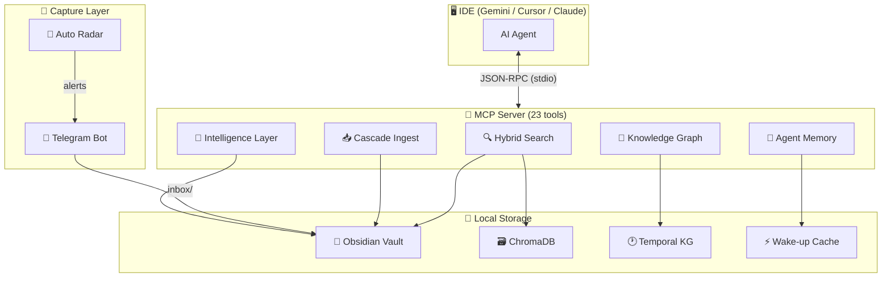

# 🧠 Obsidian Second Mind

> Turn your Obsidian vault into a **living, self-maintaining Second Brain** for AI coding agents.

[](https://python.org)
[](LICENSE)
[](https://modelcontextprotocol.io)
[](https://github.com/nzt108-dev/obsidian-second-mind)

An MCP (Model Context Protocol) server that gives AI assistants **instant access** to your Obsidian knowledge base — architecture decisions, coding guidelines, project requirements, and business logic. But it goes far beyond simple search:

- 🔍 **Semantic + keyword hybrid search** for maximum recall
- 🧬 **Temporal Knowledge Graph** that tracks how your stack evolves over time
- 📥 **Telegram Capture Bot** to throw ideas from your phone into the vault
- 🔄 **Cascade Ingest** — one source automatically updates N wiki pages
- 🧠 **Agent Memory** — AI never loses context between sessions
- ⚡ **Fully local** — no cloud, no API keys, everything on your machine

---

## 📐 Architecture



---

## ✨ Feature Matrix

| Layer | Version | Features |
|-------|---------|----------|
| **Core** | v0.1 | Vault parser, semantic search, MCP server, file watcher |
| **Wiki Engine** | v0.3 | WikiLink graph, index.md + log.md (Karpathy pattern), vault linter |
| **Adaptive Brain** | v0.4 | Decay scoring, knowledge graph, pattern extraction |
| **Intelligence** | v0.5 | Session analyzer, tech radar, dependency checker |
| **Capture & Recall** | v0.6 | Telegram bot, wake-up context, inbox processing |
| **Cascade** | v0.7 | Cascade ingest (1→N updates), auto radar with diff tracking |
| **Temporal Brain** | v0.8 | Temporal KG (valid_from/to), contradiction detection, fact extraction |
| **Agent Memory** | v0.9 | Session save/load, emergency save, enhanced wake-up with memory |
| **Ultimate Brain** | v1.0 | Polish, documentation, release-ready |

---

## 🚀 Quick Start

### 1. Install

```bash
git clone https://github.com/nzt108-dev/obsidian-second-mind.git
cd obsidian-second-mind

python -m venv .venv
source .venv/bin/activate
pip install -e ".[dev]"
```

### 2. Configure

```bash
cp .env.example .env
# Edit .env:
# OBSIDIAN_BRIDGE_VAULT_PATH=~/SecondMind
```

### 3. Build Index

```bash
obsidian-bridge index
```

### 4. Connect to IDE

Add to your IDE's MCP configuration:

```json
{
  "mcpServers": {
    "obsidian-second-mind": {
      "command": "/path/to/.venv/bin/obsidian-bridge",
      "args": ["serve"]
    }
  }
}
```

### 5. (Optional) Telegram Bot

```bash
# Set your bot token in .env:
# OBSIDIAN_BRIDGE_TELEGRAM_BOT_TOKEN=your-token
# OBSIDIAN_BRIDGE_TELEGRAM_ALLOWED_USERS=123456789

obsidian-bridge bot
```

---

## 🛠️ MCP Tools (23 total)

### Core (7 tools)
| Tool | Description |
|------|-------------|
| `search_vault` | Hybrid semantic + BM25 search across the vault |
| `get_project_context` | Full project context (PRD + Architecture + Rules) |
| `get_global_rules` | Global coding standards and design principles |
| `list_projects` | List all projects with note counts |
| `get_note` | Read a specific note by path |
| `create_note` | Create notes (10 types: prd, architecture, decision, etc.) |
| `update_note` | Append or replace content in existing notes |

### Wiki & Knowledge (5 tools)
| Tool | Description |
|------|-------------|
| `lint_vault` | Health-check: orphans, stale notes, broken links, TODOs |
| `rebuild_index` | Rebuild vector index + regenerate index.md |
| `query_graph` | WikiLink graph: neighbors, paths, hubs, clusters |
| `extract_patterns` | Analyze decisions for success/failure patterns |
| `save_insight` | Save search synthesis back to wiki (compounding loop) |

### Intelligence (3 tools)
| Tool | Description |
|------|-------------|
| `analyze_sessions` | Find repeating problems across session logs |
| `scout_tools` | Scan internet for new relevant tools & MCP servers |
| `check_dependencies` | Check npm/pip/flutter deps for updates & security |

### Capture (3 tools)
| Tool | Description |
|------|-------------|
| `get_wakeup_context` | Compact ~200 token context for session start |
| `ingest_source` | Cascade ingest: 1 source → N wiki updates |
| `auto_radar_scan` | Tech radar scan with diff tracking + Telegram alerts |

### Temporal Brain (4 tools)
| Tool | Description |
|------|-------------|
| `kg_add_fact` | Add temporal fact with validity window |
| `kg_invalidate` | Mark a fact as no longer valid |
| `kg_timeline` | Chronological history of entity facts |
| `kg_check_contradictions` | Detect conflicting facts in KG |

### Agent Memory (3 tools)
| Tool | Description |
|------|-------------|
| `save_session` | Save session context (git, decisions, next steps) |
| `load_session` | Load last session snapshot for instant recall |
| `get_enhanced_wakeup` | Standard + memory + KG wake-up context |

---

## 🖥️ CLI Commands

```bash
# Core
obsidian-bridge serve              # Start MCP server (stdio)
obsidian-bridge index              # Build/rebuild search index
obsidian-bridge search "auth flow" # Search from terminal
obsidian-bridge watch              # Auto-index on file changes
obsidian-bridge status             # Vault & index stats

# Projects
obsidian-bridge list-projects      # Show all projects
obsidian-bridge add-project slug   # Create project structure

# Capture
obsidian-bridge bot                # Start Telegram bot
obsidian-bridge ingest "text" -p project  # Cascade ingest
obsidian-bridge radar              # Run tech radar scan

# Agent Memory
obsidian-bridge save project       # Save session context
obsidian-bridge emergency-save project  # Fast emergency save

# Dashboard
obsidian-bridge dashboard          # Launch web dashboard
```

---

## 📁 Vault Structure

```
~/SecondMind/
├── _global/              # Rules for ALL projects
│   ├── coding-standards.md
│   ├── tech-stack.md
│   └── design-principles.md
├── _memory/              # Agent Memory snapshots (auto-managed)
│   ├── wakeup-cache.json
│   └── {project}-latest.json
├── _templates/           # Note templates
├── inbox/                # Quick notes from Telegram
├── my-project/           # Per-project knowledge
│   ├── prd.md
│   ├── architecture.md
│   ├── api-rules.md
│   ├── ui-guidelines.md
│   └── decisions/
│       └── 001-chose-flutter.md
├── index.md              # Auto-generated vault catalog
├── log.md                # Chronological operation log
└── knowledge-graph.json  # Temporal KG storage
```

### Note Frontmatter

```yaml
---
project: my-project
type: architecture    # prd | architecture | guidelines | api | decision
                      # note | concept | comparison | synthesis | research
tags:
  - auth
  - flutter
priority: high        # high | medium | low
created: 2026-04-09
updated: 2026-04-09
---
```

---

## 🧪 How It Works

### Search Pipeline
1. **Parser** reads `.md` files, extracts YAML frontmatter, resolves `[[wikilinks]]`
2. **Indexer** splits notes into chunks, creates embeddings via `sentence-transformers`
3. **Hybrid Search** combines ChromaDB (semantic) + BM25 (keyword) with RRF fusion
4. **Decay Scoring** boosts recent, high-priority notes

### Knowledge Graph
1. WikiLinks build a directed graph between notes
2. **Temporal KG** adds `valid_from`/`valid_to` windows to facts
3. **Contradiction Detector** finds conflicting active facts
4. **Fact Extractor** auto-updates KG from note content (regex, no LLM)

### Agent Memory
1. **save_session** captures git state, decisions, and next steps → JSON + vault note
2. **load_session** restores context at session start (~0.1s)
3. **Enhanced wake-up** = standard context + last session memory + active KG facts
4. **Emergency save** — minimal fast path before context loss

### Cascade Ingest
1. Raw source (text/URL/note) enters the system
2. Entity extraction finds projects, technologies, concepts
3. Primary note is created in target project
4. Cross-references are added to all related existing notes
5. Concept stubs are created for new entities
6. A single ingest can touch 5-15 wiki pages

---

## 📊 Codebase Stats

| Metric | Value |
|--------|-------|
| Total Python LOC | ~8,000 |
| Modules | 20 |
| MCP Tools | 23 |
| CLI Commands | 14 |
| Test Coverage | 18 tests |
| Dependencies | 12 core + 3 dev |

---

## 🔒 Privacy & Cost

- **100% local** — all data stays on your machine
- **No API keys required** — embeddings via local `sentence-transformers`
- **No LLM needed** — fact extraction, KG, ingest all use deterministic algorithms
- **Zero cost** — free forever for personal use

---

## 📄 License

MIT — see [LICENSE](LICENSE)

## 🤝 Contributing

PRs welcome! Please open an issue first to discuss what you'd like to change.

```bash
# Development setup
pip install -e ".[dev]"
ruff check src/
pytest tests/ -v
```
