# 🗺️ Architecture — Obsidian Second Mind

> Auto-generated + manually curated. Last updated: 2026-04-15

---

## 🏗️ High-Level Architecture

```
┌─────────────────────────────────────────────────────────────────┐
│                    AI Agent (Claude / Cursor / Gemini)          │
└────────────────────────────┬────────────────────────────────────┘
                             │ JSON-RPC over stdio
                             ▼
┌─────────────────────────────────────────────────────────────────┐
│                        MCP Server Layer                         │
│  mcp_server.py  ←  23 tools exposed to the AI agent            │
└──┬──────┬───────┬────────┬──────────┬──────────┬───────────────┘
   │      │       │        │          │          │
   ▼      ▼       ▼        ▼          ▼          ▼
search  graph   memory   ingest    architect  wakeup
indexer graph.py hooks.py ingest.py architect.py wakeup.py
   │
   ▼
┌─────────────────────────────────────────────────────────────────┐
│                      Storage Layer                              │
│  📁 Obsidian Vault (.md files)                                  │
│  🗃️ ChromaDB (vector embeddings)                               │
│  🕐 knowledge-graph.json (temporal facts)                       │
│  ⚡ _memory/*.json (session snapshots)                          │
└─────────────────────────────────────────────────────────────────┘
```

---

## 🔗 Module Dependency Graph

```mermaid
graph TD
    subgraph entry["🚪 Entry Points"]
        CLI["cli.py\nCLI commands"]
        MCP["mcp_server.py\n23 MCP tools (1640L)"]
        BOT["telegram_bot.py\nCapture bot (804L)"]
    end

    subgraph core["⚙️ Core Engine"]
        PARSER["parser.py\nVault file parser (170L)"]
        INDEXER["indexer.py\nChromaDB + BM25 (773L)"]
        GRAPH["graph.py\nWikiLink graph (702L)"]
        MODELS["models.py\nData models (63L)"]
        CONFIG["config.py\nPydantic settings (125L)"]
    end

    subgraph brain["🧠 AI Brain"]
        WAKEUP["wakeup.py\nWake-up context (222L)"]
        HOOKS["hooks.py\nAgent Memory (534L)"]
        INGEST["ingest.py\nCascade ingest (394L)"]
        FACT["fact_extractor.py\nTemporal KG (385L)"]
        PATTERNS["patterns.py\nPattern mining (228L)"]
    end

    subgraph intel["📡 Intelligence"]
        SCOUT["scout.py\nTool scouting (880L)"]
        RADAR["auto_radar.py\nTech radar (279L)"]
        ARCHER["architect.py\nArch scanner (520L)"]
        PACKER["context_packer.py\nCode packer (434L)"]
        GH_RADAR["github_radar.py\nGitHub trending (639L)"]
        LINTER["linter.py\nVault linter (340L)"]
    end

    subgraph dashboard["🖥️ Dashboard"]
        DASH_SRV["dashboard_server.py\nHTTP server (62L)"]
        DASH_DATA["dashboard_data.py\nData API (127L)"]
        WATCHER["watcher.py\nFile watcher (153L)"]
    end

    %% Entry → Core
    CLI --> CONFIG
    CLI --> MCP
    CLI --> PARSER
    CLI --> INDEXER
    CLI --> INGEST
    CLI --> RADAR
    CLI --> HOOKS
    CLI --> BOT
    CLI --> WATCHER
    CLI --> DASH_SRV

    %% MCP → Everything
    MCP --> CONFIG
    MCP --> INDEXER
    MCP --> LINTER
    MCP --> PARSER
    MCP --> PATTERNS
    MCP --> SCOUT
    MCP --> WAKEUP
    MCP --> INGEST
    MCP --> RADAR
    MCP --> ARCHER
    MCP --> GRAPH
    MCP --> FACT
    MCP --> HOOKS
    MCP --> GH_RADAR
    MCP --> PACKER

    %% Core dependencies
    INDEXER --> CONFIG
    INDEXER --> MODELS
    PARSER --> MODELS
    GRAPH --> PARSER
    WATCHER --> CONFIG
    WATCHER --> INDEXER
    WATCHER --> PARSER
    WATCHER --> MCP

    %% Brain dependencies
    HOOKS --> WAKEUP
    HOOKS --> GRAPH
    INGEST --> PARSER
    INGEST --> FACT
    FACT --> GRAPH
    PATTERNS --> PARSER
    WAKEUP --> PARSER

    %% Intelligence
    RADAR --> SCOUT
    SCOUT --> PARSER
    LINTER --> PARSER

    %% Dashboard
    DASH_SRV --> DASH_DATA
    DASH_DATA --> CONFIG

    %% Bot
    BOT --> CONFIG
    BOT --> PARSER
    BOT --> INDEXER

    %% Styles
    style MCP fill:#7C3AED,color:#fff
    style CLI fill:#2563EB,color:#fff
    style BOT fill:#0891B2,color:#fff
    style CONFIG fill:#374151,color:#fff
    style MODELS fill:#374151,color:#fff
    style PARSER fill:#059669,color:#fff
    style INDEXER fill:#059669,color:#fff
    style GRAPH fill:#059669,color:#fff
    style HOOKS fill:#B45309,color:#fff
    style WAKEUP fill:#B45309,color:#fff
    style INGEST fill:#B45309,color:#fff
    style FACT fill:#B45309,color:#fff
    style SCOUT fill:#9333EA,color:#fff
    style RADAR fill:#9333EA,color:#fff
    style ARCHER fill:#9333EA,color:#fff
    style GH_RADAR fill:#9333EA,color:#fff
```



---

## 📦 Module Reference

### Entry Points

| Module | File | Lines | Description |
|--------|------|-------|-------------|
| `cli` | `src/obsidian_bridge/cli.py` | 378 | Click CLI — all commands (`serve`, `index`, `search`, `bot`, ...) |
| `mcp_server` | `src/obsidian_bridge/mcp_server.py` | 1640 | **Core** — exposes 23 MCP tools to AI agents |
| `telegram_bot` | `src/obsidian_bridge/telegram_bot.py` | 804 | Telegram capture bot — inbox + article extraction |

### Core Engine

| Module | File | Lines | Description |
|--------|------|-------|-------------|
| `parser` | `src/obsidian_bridge/parser.py` | 170 | Reads `.md` files, parses YAML frontmatter, resolves `[[WikiLinks]]` |
| `indexer` | `src/obsidian_bridge/indexer.py` | 773 | ChromaDB vector store + BM25 + RRF hybrid search |
| `graph` | `src/obsidian_bridge/graph.py` | 702 | WikiLink graph + temporal KG (valid_from/valid_to facts) |
| `models` | `src/obsidian_bridge/models.py` | 63 | Dataclasses: `Note`, `SearchResult`, `KGFact`, etc. |
| `config` | `src/obsidian_bridge/config.py` | 125 | Pydantic settings from `.env` / environment |

### AI Brain

| Module | File | Lines | Description |
|--------|------|-------|-------------|
| `wakeup` | `src/obsidian_bridge/wakeup.py` | 222 | Wake-up context generator (~200 tokens for session start) |
| `hooks` | `src/obsidian_bridge/hooks.py` | 534 | Agent Memory — save/load session snapshots |
| `ingest` | `src/obsidian_bridge/ingest.py` | 394 | Cascade ingest: 1 source → N wiki page updates |
| `fact_extractor` | `src/obsidian_bridge/fact_extractor.py` | 385 | Extract temporal facts from note content |
| `patterns` | `src/obsidian_bridge/patterns.py` | 228 | Mine success/failure patterns from decision notes |

### Intelligence Layer

| Module | File | Lines | Description |
|--------|------|-------|-------------|
| `scout` | `src/obsidian_bridge/scout.py` | 880 | Internet scan for relevant tools and MCP servers |
| `auto_radar` | `src/obsidian_bridge/auto_radar.py` | 279 | Tech radar with diff tracking + Telegram alerts |
| `architect` | `src/obsidian_bridge/architect.py` | 520 | AST-based architecture scanner → Mermaid maps |
| `context_packer` | `src/obsidian_bridge/context_packer.py` | 434 | Pack project source code for AI context |
| `github_radar` | `src/obsidian_bridge/github_radar.py` | 639 | GitHub trending repos scanner |
| `linter` | `src/obsidian_bridge/linter.py` | 340 | Vault health checks: orphans, stale notes, broken links |

### Dashboard & Utilities

| Module | File | Lines | Description |
|--------|------|-------|-------------|
| `dashboard_server` | `src/obsidian_bridge/dashboard_server.py` | 62 | Minimal HTTP server for the web dashboard |
| `dashboard_data` | `src/obsidian_bridge/dashboard_data.py` | 127 | Data layer for dashboard API |
| `watcher` | `src/obsidian_bridge/watcher.py` | 153 | Watchdog file watcher → auto-reindex on changes |

---

## 🔄 Key Data Flows

### Search Flow
```
User query
    → indexer.hybrid_search()
        → ChromaDB semantic search (top-K)
        → BM25 keyword search (top-K)
        → RRF fusion ranking
        → Decay scoring (recency × priority)
    → ranked results with context
```

### Cascade Ingest Flow
```
Raw source (text/URL)
    → ingest.process()
        → entity extraction (projects, technologies, concepts)
        → create primary note in target project
        → find all related notes via graph.neighbors()
        → append cross-references to each related note
        → create concept stubs for new entities
    → 5–15 vault pages updated
```

### Agent Memory Flow
```
Session end → hooks.save_session()
    → capture git state (commits, dirty files)
    → capture decisions made this session
    → write JSON snapshot to _memory/{project}-latest.json
    → write session note to vault

Session start → hooks.load_session()
    → load JSON snapshot (0.1s)
    → merge with wakeup context
    → merge with active KG facts
    → return enhanced context to agent
```

### Temporal KG Flow
```
kg_add_fact("app", "uses_auth", "clerk")
    → stores with valid_from=today
    → checks for contradictions with existing facts

Later: kg_invalidate("app", "uses_auth", "clerk")
    → sets valid_to=today

kg_add_fact("app", "uses_auth", "supabase")
    → new fact starts

kg_timeline("app")
    → returns chronological history of all facts
```

---

## 📊 Stats

| Metric | Value |
|--------|-------|
| Total modules | 20 |
| Total Python LOC | ~8,000 |
| MCP tools | 23 |
| CLI commands | 14 |
| External dependencies | 12 core |
| Test files | 3 |
